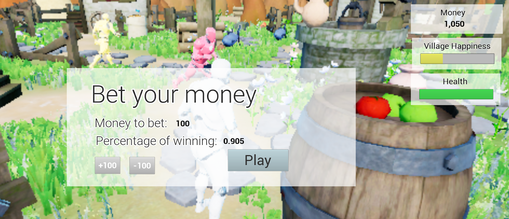

# CS179N Senior Design - Final Project

# Villagecraft

A game by [Elijah Marchese](https://github.com/acertainelijah), [Jessica Gonzalez](https://github.com/jgonz01), [Brandon Tran](https://github.com/regice), [Ryan Yuzuki](https://github.com/ryuzu001) and [Bao Luong](https://github.com/smugleaf42)

Pitch: We are making a 3D, third-person Unreal Engine game. The player will be a town mayor that manages a village, and his objective is to expand it as much as possible. Some of his tasks include: ensuring villager satisfaction, building homes, collecting taxes, and gathering resources.

___________________

# Video

See a quick demo of the game here: https://youtu.be/PyUmHz5qLfE

# Overview

This game is a life-simulation experience played in a 3D environment in the third-person perspective. In this game, you take the role of a mayor who manages an initially empty village. Their objective is to expand it as much as possible while performing various tasks. Some of these tasks include: building homes, collecting taxes, gathering resources, defending against invaders, a mini game, and ensuring villager satisfaction. The player must maintain the village on their own through these various quests.
    
As mayor, the player is able to perform various tasks to improve the village. Building homes allows new villagers to move in at the player’s discretion. After a certain period of time, these villagers will pay taxes, which are a way for the player to earn money. Said money can be used to build new homes and purchase resources. The player is also able to collect resources by interacting with the world. Calculated based on the amount of certain resources and villagers, villager satisfaction will be an indicator of how well the village is doing.

_________________

# Gameplay

We started with the [Advanced Village Pack](https://www.unrealengine.com/marketplace/en-US/slug/advanced-village-pack) for Unreal Engine and built upon it. In total, we added the following: 

- Money (increment/decrement)
- Health 
- Other AI villagers (request/decline)
- AI Enemies that chase the player and deal damage
- Minimap
- Spawn houses (edit, rotate, move)
- Pause/Save Game
- Bet money minigame
- Main menu
- Music
- Tax collection
- Village happiness

________________

# Screenshots

In game screenshot of the bet-your-money minigame

A shot of the pause menu, with various tracked stats visible

Villager request

The blueprint for the bet-your-money minigame. This shows the logic behind winning.

________________

# Implementation
For our game engine, we decided to use Unreal Engine 4. While some of our team has had experience with other game engines (ie. Unity), we decided to use Unreal for the features offered at the free price point provided. In addition, we decided to use Unreal because of the built in support for version control (Perforce), as we struggled trying to use other methods of version control such as git. Although Unreal is built to be user-friendly with a gentle learning curve, some of the features such as blueprints initially provided a challenge. Overall, we are satisfied with the project that we built and the methods used to achieve it. 

Our project needed a form of Version Control in order to have a central repository of our team to access our work and keep logged stages of the changes in our project. We decided to use Perforce for our Version Control. Having our work on a personal central server allows us to use more than 1GB of data if needed. We used Unreal Engine’s in-engine source control. Perforce allowed us to work on files independently and file versions without having to worry about merge issues. 

# Perforce

Here's a screenshot of the Perforce commit log after we switched from github.

________________

# Compiling

Just clone or download this repository and open it in Unreal Engine 4, which can be downloaded [here](https://www.unrealengine.com/en-US/download). If your computer doesn't compile some blueprints correctly, it's probably because the game music is over 100mb and is too large to be uploaded to github. Feel free to use your own, or download the original from [MEGA](https://mega.nz/#!pKhFBIBC!9XTlYpxS_lssxf3sacoYNVm244a2wDTBkiSV6qu8fzw), and link it in the levels/RealWorld blueprint.

# Difficulties and Challenges

There was one task that we originally had planned that we did not do this quarter. This task was creating a beginner tutorial for the player. Along the way, we realized the tutorial depended on our other sprint tasks, so unfortunately we did not have enough time to work on the tutorial. And now that we have the know-how, we would probably start with Perforce rather than git, since merge conflicts and deleted blueprints slowed us down initially.

